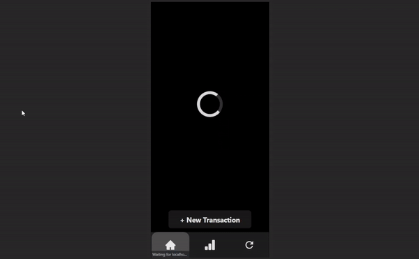

# Expense Tracker
A web application designed for the phone, aiming to make tracking expenses easy and compatible with Google spreadsheets.

The App: [https://expense-tracker-web-1ge1.onrender.com](https://expense-tracker-web-1ge1.onrender.com)
 Check out [iOS Setup](#ios-device-setup)

For Login-less Demo: [https://expense-tracker-web-demo.onrender.com](https://expense-tracker-web-demo.onrender.com/)
 *This server will take a minute to spin up

***
## What does it do?
- Retrieves formatted transaction data from personal Google Sheets to be displayed comfortably on phone screens.
- Allows user to enter new transactions while on the go with the clicks of a few buttons.
- Supports secure Google Login, accessing spreadsheet through URL.
- Uses Cookies to enable persistent login, no need for repeated sign-ins.
- Syncs data to Google Sheets real time for accessibility.
- Filters transaction history based on selected time periods.

***
## iOS Device Setup
1. Go to the browser of your choice (Chrome or Safari is best)
2. Navigate to [https://expense-tracker-web-1ge1.onrender.com](https://expense-tracker-web-1ge1.onrender.com)
3. Press the "Share" button   
4. Select the "Add to Home Screen"
5. Find your App on your Home Screen, and it's all done!

***
## Config
- **Python**: 3.11.5
- **ReactJS**: 18.2.0
- **Flask**: 3.0.0
- **Pandas**: 2.1.3
  
*See requirements.txt for other pip dependencies*

## History
See [Old Expense Tracker Repo](https://github.com/Kevin-Wei-KW/ExpenseTracker) for detailed development commit history.
